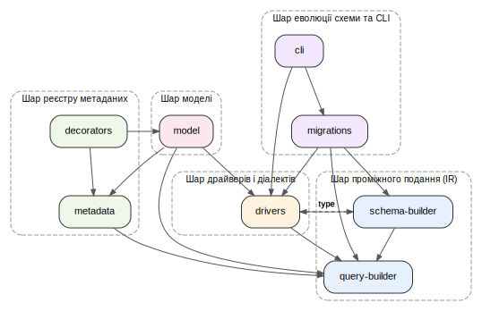

## 2.1 Загальна архітектура: модулі та граф залежностей

Архітектура YAOI декомпозована на вісім самостійних модулів, кожен із яких реалізує єдиний клас відповідальності та публікує мінімальну поверхню API, достатню для його споживачів. Така декомпозиція безпосередньо реалізує вимогу Н.2 щодо шарової архітектури з ациклічним графом залежностей і дає змогу розвивати кожен модуль незалежно — за умови, що його контракт залишається сталим. Принципова відмінність запропонованого поділу від моноблочних реалізацій, розглянутих у підрозділі 1.4, полягає в тому, що залежності між модулями виражені через інтерфейси (`Driver`, `Dialect`, `MetadataStorage`), а не через конкретні класи, що залишає простір для альтернативних реалізацій будь-якого шару без впливу на сусідні.

**Таблиця 2.1 — Модулі YAOI**

| Модуль | Призначення | Публічна поверхня |
|---|---|---|
| `query-builder` | Програмне конструювання абстрактного синтаксичного дерева (AST) виразів DML — `SELECT`, `INSERT`, `UPDATE`, `DELETE` — у вигляді, не прив'язаному до конкретного діалекту. | `SelectQueryBuilder`, `InsertQueryBuilder`, `UpdateQueryBuilder`, `DeleteQueryBuilder`, `ConditionBuilder`; типи `SelectQuery`, `InsertQuery`, `UpdateQuery`, `DeleteQuery`. |
| `schema-builder` | Програмне конструювання DDL-операцій — створення, зміна, видалення таблиць та обмежень — як AST окремої від DML форми. | `SchemaBuilder`, `TableBuilder`, `AlterTableBuilder`, `ColumnBuilder`, `ForeignKeyBuilder`; типи `CreateTableQuery`, `AlterTableQuery`, `DropTableQuery`, `ColumnSpec`. |
| `metadata` | Глобальний реєстр метаданих сутностей: відображення «клас сутності → опис стовпців, ключів та зв'язків». | `DefaultMetadataStorage`, `defaultMetadataStorage`; типи `EntityMetadata`, `ColumnMetadata`, `RelationMetadata`. |
| `decorators` | Декларативний опис сутностей TypeScript-декораторами; читання типів через `reflect-metadata` і заповнення реєстру `metadata`. | `@Entity`, `@Column`, `@PrimaryKey`, `@OneToOne`, `@OneToMany`, `@ManyToOne`, `@ManyToMany`, `@EntityRepository`. |
| `drivers` | Контракт виконання запитів — підключення, виконання DML і DDL, керування транзакціями — та конкретна реалізація для PostgreSQL із компіляторами AST у SQL обраного діалекту. | Інтерфейси `Driver`, `Dialect`, `ParameterManager`, `QueryCompiler`; класи `DriverFactory`, `PostgresDriver`, `PostgresDialect`. |
| `model` | Подвійний публічний API — Active Record через `BaseModel` і Repository через `DataSource.getRepository(...)` — на спільному ядрі. Ambient-пропагація транзакцій. | `DataSource`, `BaseModel`, `Repository`, `EntityManager`, `makeRepository`, `withRolledBackTransaction`. |
| `migrations` | Підсистема міграцій: виявлення файлів, контроль цілісності за контрольними сумами, рекомендаційне блокування, застосування й відкат у транзакції. | `MigrationRunner`, `ChecksumMismatchError`, `ensureTrackingTable`, `discoverMigrations`. |
| `cli` | Командний інтерфейс над `migrations`: команди `up`, `down`, `status`, `make`; завантаження конфігурації проєкту. | `defineConfig`, `YaoiConfig`, `CliUsageError`, `ConfigNotFoundError`. |

Зв'язки між модулями утворюють спрямований ациклічний граф, поданий на рисунку 2.1. Залежності організовано у п'ять рівнів: шар проміжного подання (`query-builder` і `schema-builder`) — листя графа, незалежне від решти; шар реєстру метаданих (`metadata` і `decorators`); шар драйверів і діалектів (`drivers`); шар моделі (`model`); шар еволюції схеми та CLI (`migrations`, `cli`). Кожен модуль звертається виключно до модулів нижчих або того самого рівня, що унеможливлює циклічні залежності у рантаймі.

**Рисунок 2.1 — Граф залежностей модулів YAOI**

На рисунку 2.1 суцільні стрілки означають значеннєві імпорти (класи, функції, константи), а пунктирні — type-only імпорти. Взаємне посилання `schema-builder ↔ drivers` належить виключно до другої категорії: `schema-builder` тримає інтерфейсний тип `Driver`, тоді як `drivers` тримає DDL-AST-типи (`DdlQuery`, `ColumnSpec`, `CreateTableQuery` тощо), які компілюються у PostgreSQL-специфічний SQL. Оскільки type-only імпорти стираються компілятором TypeScript, реального циклу у рантаймі між цими модулями не виникає; натомість таке розділення значень і типів закріплює інверсію залежностей — контракт виконавця (`Driver`) описаний на боці його споживача (`schema-builder`), а не навпаки.

Подальші підрозділи розглядають окремі виміри цієї архітектури: підрозділ 2.2 деталізує розділення конвеєрів DML і DDL на рівні системи типів, що є центральним рішенням для модулів `query-builder`, `schema-builder` і `drivers`.
