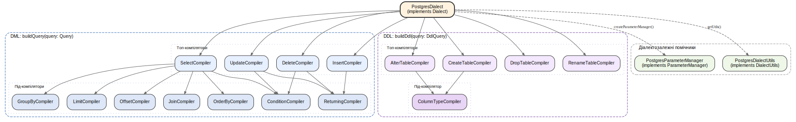

## 2.3 Шар драйверів і діалектів, точки розширення

Шар драйверів і діалектів реалізує вимогу Ф.1 щодо мультидіалектної архітектури через два ортогональні інтерфейси: `Driver` як контракт виконання операцій над базою та `Dialect` як контракт компіляції AST-вузла у текст SQL. Така ортогональність дає змогу варіювати кожну з осей незалежно — наприклад, замінити PostgreSQL-клієнт (`pg.Pool` на `pg-native`) без змін у компіляторах, або реалізувати компілятори нового діалекту поверх того ж транспортного шару. Стартова реалізація YAOI покриває лише PostgreSQL; решта діалектних реалізацій передбачені на рівні типів і фабрики як зарезервовані точки розширення.

### 2.3.1 Контракт `Driver`

`Driver` поєднує життєвий цикл з'єднання, три точки виконання та транзакційний метод (лістинг 2.3).

**Лістинг 2.3 — Інтерфейс `Driver`**

```ts
export interface Driver {
  connect(): Promise<void>;
  disconnect(): Promise<void>;
  isConnected(): boolean;
  getDialect(): Dialect;
  query<TRow = Record<string, unknown>>(
    q: Query,
  ): Promise<QueryResult<TRow>>;
  ddl(q: DdlQuery): Promise<QueryResult>;
  raw<TRow = Record<string, unknown>>(
    sql: string,
    params?: readonly unknown[],
  ): Promise<QueryResult<TRow>>;
  withTransaction<R>(fn: (tx: Driver) => Promise<R>): Promise<R>;
}
```

Три точки виконання покривають три рівні абстракції доступу. Метод `query(...)` приймає AST DML-запиту і повертає рядки заданої форми. Метод `ddl(...)` приймає AST DDL-операції та повертає `QueryResult` без рядків. Метод `raw(...)` — навмисно вузька «крайова» точка для сирого SQL; його існування фіксує усвідомлене виключення з типобезпеки (підрозділ 1.3.2): окремий вхід, що відразу видно у коді, замість прихованих рядкових втеч у `query()`/`ddl()`. Метод `withTransaction(...)` обгортає виконання функції у транзакцію, передаючи у `fn` спеціальний транзакційний `Driver`, який утримує те саме з'єднання для всіх запитів усередині блоку, — деталі ambient-пропагації цього контексту розглянуто у підрозділі 2.7.

### 2.3.2 `Dialect` як композиція компіляторів

`Dialect` — це контракт, що зводить AST-вузол до `CompiledQuery { sql, params }`. Замість того, щоб бути однією монолітною функцією, конкретна реалізація розкладається на множину дрібних компіляторів за узагальненим контрактом `QueryCompiler<T extends QueryCommon>` із єдиним методом `compile(query, ctx): string`. Спільний стан компіляції — параметри, лексичні утиліти та dispatch-функції для рекурсії — переноситься між викликами через `CompilationContext`. Завдяки цьому компілятори вузлів верхнього рівня (наприклад, `SelectCompiler`) можуть делегувати обробку фрагментів (умови у `WHERE`, вкладений `SELECT`) під-компіляторам, не маючи прямих посилань на конкретні класи.

Декомпозиція `PostgresDialect` подана на рисунку 2.2: дві дискретні гілки компіляції (`buildQuery` і `buildDdl`) спираються на шістнадцять компіляторів — чотири топ-компілятори DML і чотири DDL, а також сім спільних під-компіляторів DML (`Condition`, `Join`, `OrderBy`, `GroupBy`, `Limit`, `Offset`, `Returning`) та один спільний DDL (`ColumnType`). Топ-компілятори отримують потрібні під-компілятори через конструктор, що робить заміну будь-якого компонента (наприклад, для діалектного відхилення у синтаксисі `RETURNING`) питанням підстановки іншої реалізації того ж контракту, а не правки коду споживача.



**Рисунок 2.2 — Композиція `PostgresDialect` із компіляторів**

Диспетчеризація між топ-компіляторами відбувається через `switch` за дискримінатором AST (`QueryType` для DML, `DdlQueryType` для DDL). Оскільки обидва юніони замкнені та містять скінченну кількість тегів, компілятор TypeScript у налаштуваннях `strict` забезпечує вичерпність кожного `switch`: додавання нового AST-вузла без відповідної гілки спричиняє помилку компіляції.

### 2.3.3 Діалектозалежні помічники

Дві групи лексичних рішень виносяться з компіляторів у окремі контракти, які діалект надає через свої фабричні методи. Перший — `DialectUtils` — інкапсулює правила формування ідентифікаторів: `escapeIdentifier(name)` обгортає ім'я у відповідні лапки (`"name"` у PostgreSQL, `` `name` `` у MySQL), а `qualifyTable(...)` і `qualifyColumn(...)` формують повноіменні посилання з урахуванням схеми та аліасу. Другий — `ParameterManager` — інкапсулює синтаксис плейсхолдерів параметрів: метод `add(value)` додає значення до впорядкованого списку та повертає рядок, який можна підставити в SQL-текст. Для PostgreSQL це `$1, $2, …`; для MySQL — `?`; для Oracle — `:1`. Обидва помічники створюються діалектом і передаються у `CompilationContext`, через який компілятори отримують до них доступ.

### 2.3.4 `DriverFactory` як точка реєстрації

Зв'язок між конфігурацією та конкретним класом драйвера локалізовано у `DriverFactory`. Конфігурація `DriverConfig` є дискримінованим юніоном за полем `type` (`DBType.POSTGRES | DBType.MYSQL | DBType.SQLITE`), що дає звуження типу всередині `switch` і гарантує передання у конструктор драйвера лише тієї конфігурації, яка йому потрібна. Гілки для MySQL і SQLite уже зарезервовано як `NotImplementedError`: дискримінатор присутній у юніоні, відповідне значення `DBType` оголошене, а у фабриці вже передбачено відповідну гілку `switch`. Це означає, що додавання реального драйвера зводиться до заміни виключення на конструювання нового класу — без розширення публічного API фабрики.

### 2.3.5 Контракт додавання нового діалекту

Аналіз попередніх пунктів дає вичерпний перелік того, що необхідно реалізувати для підтримки нового діалекту:

1. **Реалізація `Dialect`** — клас із власними топ- і під-компіляторами під обидві гілки (`buildQuery`, `buildDdl`); чотири DML-вузли і чотири DDL-вузли мають бути покриті власними компіляторами, тоді як спільні фрагменти, синтаксис яких збігається з PostgreSQL, можуть бути перевикористані без змін.
2. **Реалізація `DialectUtils` і `ParameterManager`** — лексика ідентифікаторів та синтаксис плейсхолдерів конкретного діалекту.
3. **Реалізація `Driver`** — клас поверх клієнтської бібліотеки відповідної СКБД (наприклад, `mysql2` або `better-sqlite3`); інтеграція з фабрикою зводиться до заміни `NotImplementedError` на конструктор.

Шар моделі, білдери та підсистема міграцій під час такого додавання не змінюються, оскільки їхній код працює виключно через інтерфейси `Driver` і AST-типи `Query`/`DdlQuery`, а не з конкретними класами.

Реєстр метаданих, що забезпечує типову узгодженість самих білдерів та моделі, розглянуто у наступному підрозділі.
