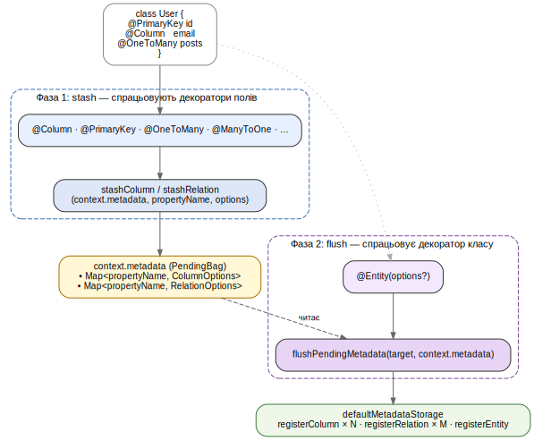

## 2.4 Реєстр метаданих і шар декораторів

Реалізація вимоги Ф.2 — декларація сутностей TypeScript-декораторами з рантайм-доступом до метаданих — побудована на двох співпрацюючих модулях: `metadata` тримає узагальнений реєстр описів сутностей, а `decorators` надає поверхневий API, що цей реєстр заповнює. Така роздільність зберігає можливість використовувати реєстр і без декораторів (наприклад, із програмною конфігурацією у тестах), а декоратори — без жорсткого зв'язку з конкретним сховищем: модуль `decorators` залежить від абстрактного інтерфейсу `MetadataStorage`, а не від класу-реалізації.

### 2.4.1 Структури метаданих

Реєстр оперує трьома типами записів, які покривають увесь обсяг інформації, потрібної білдерам і моделі. `EntityMetadata` описує клас сутності в цілому: посилання на конструктор (`target`), людиночитане ім'я (`className`), ім'я таблиці (`tableName`) і опційну схему. До нього додаються плоский список усіх стовпців `columns`, заздалегідь відфільтрований підсписок `primaryColumns`, плоский список зв'язків `relations` та денормалізовані мапи `columnsByPropertyName` і `relationsByPropertyName` для O(1) доступу за іменем властивості — це робить читання реєстру дешевим у гарячих гілках побудови запитів.

`ColumnMetadata` несе семантичний тип стовпця через юніон `ColumnType` із тринадцяти рядкових тегів (від `string` і `text` до `uuid` та `jsonb`) і дублює його опційним полем `dbType` як escape-hatch для діалект-специфічних типів. Решта полів — `nullable`, `isPrimary`, `isUnique`, числові параметри (`length`, `precision`, `scale`), стандартизоване значення за замовчуванням як юніон `{kind: "literal", value} | {kind: "raw", sql}` і стратегія генерації `generated` — задають усе, що потрібно компіляторам DDL і DML для коректного формування SQL.

`RelationMetadata` тримає тип зв'язку (`one-to-one`, `one-to-many`, `many-to-one`, `many-to-many`), резолвер цілі як лінивий thunk `resolveTarget: () => EntityTarget`, обернений бік `inverseSide`, вирішені опції з'єднання (`joinColumn` для зв'язків через зовнішній ключ, `joinTable` для many-to-many), а також прапорці `cascade` і `nullable`. Лінива форма цілі є необхідною — на момент виконання декоратора у поточному класі цільовий клас може бути ще не оголошений, особливо у двосторонніх зв'язках.

### 2.4.2 Контракт `MetadataStorage` і реалізація `DefaultMetadataStorage`

Контракт реєстру `MetadataStorage` має три точки запису — `registerEntity`, `registerColumn`, `registerRelation` — та три точки читання — `getEntity`, `hasEntity`, `getEntities`; додатково `clear()` передбачено для тестових середовищ. Реалізація `DefaultMetadataStorage` тримає внутрішньо двошарову модель: словник «чернеток» (`drafts`) накопичує проміжний стан під час реєстрації, а версійний кеш (`cache`) тримає вже зібрані `EntityMetadata`-об'єкти. Кожен виклик `register*` інкрементує глобальний лічильник версій; кеш-запис вважається валідним, доки збережена в ньому версія дорівнює поточній. Таке рішення дає одночасно дешеве читання у стаціонарному стані та гарантоване оновлення при додаванні нових сутностей у рантаймі.

Збирання `EntityMetadata` із чернетки виконується з обходом prototype chain: стовпці й зв'язки агрегуються від кореневого класу до листового, тож декларовані у базових класах поля стають видимими у нащадках без повторного оголошення. Інтегральні умови, що порушують узгодженість, поверхнею реєстру піднімаються як рантайм-помилки `MetadataError` з типізованими кодами: `DUPLICATE_ENTITY`, `DUPLICATE_COLUMN`, `DUPLICATE_RELATION`, `COLUMN_RELATION_CONFLICT` (одне ім'я властивості задеклароване і як стовпець, і як зв'язок) та `MISSING_COLUMN_TYPE` (стовпець без обов'язкового семантичного типу). Глобальний синглтон `defaultMetadataStorage` слугує де-факто реєстром, на який спираються декоратори; альтернативну реалізацію `MetadataStorage` можна підставити у тестах через структурне підтипування.

### 2.4.3 Шар декораторів

Шар декораторів складається з восьми компонентів (таблиця 2.2): один декоратор класу для сутності, два декоратори поля для стовпців (з композиційним `@PrimaryKey`), чотири декоратори поля для зв'язків — по одному для кожного типу кратності, і ще один декоратор класу для реєстрації кастомних репозиторіїв.

**Таблиця 2.2 — Декоратори YAOI**

| Декоратор | Ціль | Призначення |
|---|---|---|
| `@Entity(options?)` | клас | Реєструє клас як сутність, фіксує `tableName` та `schema`. |
| `@Column(options)` | поле | Реєструє поле як стовпець із заданим `ColumnType`. |
| `@PrimaryKey(options?)` | поле | Композиція `@Column` із `primary: true`. |
| `@OneToOne(target, options)` | поле | Зв'язок 1:1 із вирішенням цілі через `() => TargetClass`. |
| `@OneToMany(target, options)` | поле | Зв'язок 1:N. |
| `@ManyToOne(target, options)` | поле | Зв'язок N:1. |
| `@ManyToMany(target, options)` | поле | Зв'язок N:M із опційною конфігурацією сполучної таблиці. |
| `@EntityRepository(entity)` | клас | Реєструє кастомний клас репозиторію (модуль `model`) для сутності. |

Декоратори побудовані на Stage 3 TC39 decorators із підтримкою `Symbol.metadata` — тобто на новій моделі декораторів, де кожен виклик отримує об'єкт `context` із полем `metadata`, що ділиться між усіма декораторами одного класу. Це принципово відрізняє реалізацію від експериментальних декораторів TypeScript і не вимагає бібліотеки `reflect-metadata`, на відміну від декораторного підходу TypeORM (підрозділ 1.4.1). Лістинг 2.4 показує, як описана таким API сутність виглядає для розробника.

**Лістинг 2.4 — Декорована сутність**

```ts
@Entity({ name: "users" })
class User {
  @PrimaryKey({ type: "uuid", generated: "uuid" })
  id!: string;

  @Column({ type: "string", length: 320, unique: true })
  email!: string;

  @Column({ type: "string", length: 80 })
  name!: string;

  @OneToMany(() => Post, { inverseSide: "author", cascade: true })
  posts!: ReadonlyArray<Post>;
}
```

Усі field-декоратори зв'язків приймають перший аргумент як thunk `() => TargetClass`, що відкладає обчислення цільового класу до моменту, коли всі задіяні модулі вже завантажені, — інакше двосторонній зв'язок було б неможливо описати без помилки циклічного імпорту.

### 2.4.4 Двофазний запис метаданих: stash → flush

Порядок виконання декораторів у TC39-моделі фіксований: спершу спрацьовують декоратори полів — у порядку оголошення — а вже потім декоратор класу. Через це наївна реалізація, у якій field-декоратор одразу викликає `defaultMetadataStorage.registerColumn(...)`, призвела б до напівзаписаного стану реєстру: якщо клас не доходить до `@Entity` через виняток у одному з полів, частина стовпців уже потрапить у реєстр, але цілісного запису про сутність так і не буде. Натомість YAOI накопичує проміжний стан у двофазній моделі (рисунок 2.3).



**Рисунок 2.3 — Двофазний запис метаданих: stash → flush**

На stash-фазі декоратори полів не торкаються `defaultMetadataStorage`. Замість цього вони викликають внутрішні утиліти `stashColumn`/`stashRelation`, які записують опції у мапи всередині об'єкта `context.metadata`, що ділиться між усіма декораторами одного класу. На flush-фазі `@Entity` викликає `flushPendingMetadata(target, context.metadata)`, яка одним проходом проштовхує накопичений стан у реєстр через `registerColumn`/`registerRelation`, а вже після цього сам декоратор класу виконує `registerEntity(target, options)`. Якщо одна з валідацій реєстру (`DUPLICATE_COLUMN`, `MISSING_COLUMN_TYPE` тощо) кидає виняток, прапорець `registered` для цієї сутності так і залишається `false`, а `getEntity(target)` повертає `undefined` — тобто модель і білдери не отримають доступу до частково описаної сутності.

Як саме шар моделі споживає підготовлений реєстр для надання подвійного публічного API, розглянуто у наступному підрозділі.
