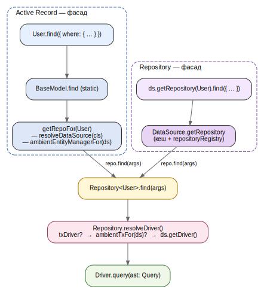

## 2.5 Подвійний публічний API: Active Record і Repository на спільному ядрі

Вимога Ф.3 формулює рідкісне для ORM рішення: одночасно публікувати два конкуруючих патерни доступу — Active Record і Repository — щоб залишити за розробником вибір ергономічного стилю без втрати можливості переходу між ними. Розглянуті у підрозділі 1.2 шаблони мають взаємодоповнювальні сфери застосування: AR дає мінімально шумливий синтаксис для CRUD-операцій і скриптів, тоді як Repository природніше вкладається в DI-контейнери, тестування з підстановкою та архітектурні стилі на кшталт DDD. У YAOI обидва фасади поділяють спільне ядро — клас `Repository<T>`, який містить усю фактичну логіку доступу до даних; AR-методи у `BaseModel` є лише делегацією до того самого `Repository`.

### 2.5.1 `DataSource` як кореневий об'єкт

`DataSource` агрегує драйвер і кеш репозиторіїв, що ним породжуються. Його життєвий цикл представлений простою стан-машиною: `new → connected → destroyed`; нелегальні переходи (виклик `getRepository()` до `initialize()` або після `destroy()`) піднімаються як типізовані помилки `ModelError`. Метод `getRepository(entity)` віддає кешований репозиторій, у разі його відсутності читає `EntityMetadata` з реєстру та звіряється з `repositoryRegistry`: за наявності кастомного класу репозиторію створює саме його, інакше — базовий `Repository`. Метод `transaction(fn)` обгортає виконання `fn` у транзакцію, прокидаючи у функцію `EntityManager` із pinned-`Driver`, що утримує одне фізичне з'єднання на всю транзакцію; деталі ambient-пропагації цього контексту розглянуто у підрозділі 2.7.

### 2.5.2 `Repository<T>` — спільне ядро

Клас `Repository<T>` містить публічну поверхню роботи з даними: групу читання (`findOne`, `findOneOrFail`, `find`, `count`, `exists`), групу запису (`create`, `insert`, `save`, `update`, `delete`, `insertMany`, `saveMany`, `upsert`, `deleteMany`), завантажувач конкретного зв'язку `loadRelation` і escape-hatch `qb(alias?)` до низькорівневого Query Builder. Конструктор приймає чотири аргументи: `dataSource`, попередньо зчитаний `metadata`, цільовий клас `target` і опційний `txDriver?`. Останній використовується лише тоді, коли репозиторій створено всередині `EntityManager` — для прив'язки до транзакційного з'єднання.

Єдиною точкою вибору драйвера у репозиторії є приватний метод `resolveDriver()` зі строго впорядкованим пріоритетом: явний `txDriver`, переданий у конструктор; за його відсутності — ambient-tx, отриманий через `ambientTxFor(this.dataSource)`; і лише за відсутності обох — звичайний драйвер `DataSource`. Такий порядок є тим єдиним місцем, де реалізована логіка вибору між транзакційним і нетранзакційним контекстами, що утримує транзакційну поведінку всіх методів послідовною.

### 2.5.3 `BaseModel` — Active Record-фасад

Клас `BaseModel` оголошує статичні методи, що дзеркалять читальну й записну поверхні `Repository`, та інстанс-методи `save`, `delete`, `reload`, `loadRelation`. Усі вони делегують виклик до `Repository` через внутрішню функцію `getRepoFor(cls)`. Резолюція `DataSource` для класу-сутності побудована як композиція двох механізмів. По-перше, статичний метод `useDataSource(ds)` зберігає прив'язку у `WeakMap`, що індексується самим класом; під час пошуку обходиться prototype chain класу, тому override на базовому класі автоматично успадковується нащадками. По-друге, у разі відсутності override запит спрямовується до глобального `getDataSource()` — синглтона, придатного для скриптів і простих сценаріїв. Завдяки цьому AR-код на зразок `await User.find({ where: { active: true } })` не потребує явного передавання `DataSource` у жодній точці виклику.

### 2.5.4 DI-сценарій: кастомні репозиторії

Для сервіс-орієнтованих застосунків YAOI пропонує два додаткові механізми. Перший — декоратор `@EntityRepository(Entity)`, що реєструє кастомний підклас `Repository` у глобальному `repositoryRegistry`. Другий — функція `makeRepository(Entity)`, що отримує репозиторій із глобально встановленого `DataSource` без явного посилання на нього у конструкторі сервісу (лістинг 2.5). Такий шлях інтегрується з типовими DI-контейнерами без додаткових адаптерів і дозволяє підставляти альтернативні реалізації репозиторію у тестах через структурне підтипування `Repository<T>`.

**Лістинг 2.5 — Кастомний репозиторій і його резолюція**

```ts
@EntityRepository(User)
class UserRepository extends Repository<User> {
  public findActive(): Promise<User[]> {
    return this.find({ where: { isActive: true } });
  }
}

class UserService {
  constructor(
    private readonly users: UserRepository =
      makeRepository(User) as UserRepository,
  ) {}

  public listActive(): Promise<User[]> {
    return this.users.findActive();
  }
}
```

Реєстр гарантує однозначність: спроба зареєструвати другий клас репозиторію для тієї самої сутності піднімається як помилка `DUPLICATE_REPOSITORY`.

### 2.5.5 Єдиний шлях під капотом

Незалежно від того, яким фасадом скористався прикладний код, виконання операції зводиться до того самого `Repository<T>` і того самого `resolveDriver()` (рисунок 2.4). AR-шлях бере участь у резолюції лише в частині знаходження потрібного `Repository`: статичний метод `BaseModel.find` віддає виклик у `getRepoFor(cls)`, який враховує ambient-`EntityManager` (якщо контекст — транзакція) і повертає `Repository` із заздалегідь встановленим `txDriver`. Repository-шлях оминає `BaseModel`, починаючи прямо з `DataSource.getRepository`. Далі обидва шляхи виконуються однаково: `Repository.find` → `resolveDriver` → `Driver.query`.



**Рисунок 2.4 — Спільний шлях Active Record і Repository**

Принципова перевага такої побудови — відсутність дублювання логіки доступу до даних: і Repository-шлях, і AR-шлях користуються одним кодом для `WHERE`, `JOIN`, гідратації результату та обробки помилок. Це означає, що зміни у поведінці (наприклад, додавання нового способу побудови `Where`) автоматично доступні з обох фасадів і не вимагають синхронізації двох гілок реалізації.

Як описана архітектура реалізує наскрізну типобезпеку — від звуження результату `find` через `Strict<T, A>` до рекурсивного `IncludeConfig<T>` довільної глибини — розглянуто у наступному підрозділі.
