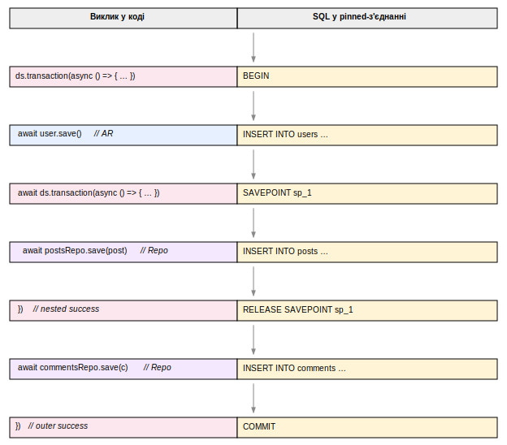

## 2.7 Транзакції та ambient-пропагація через AsyncLocalStorage

Вимога Ф.5 формулює одночасно дві властивості транзакційного API: підтримку вкладених блоків через savepoints і прозоре долучення до поточної транзакції з боку шарів бізнес-логіки. Альтернативне рішення — явний параметр `tx` у сигнатурі кожного методу репозиторію — обертається відомим антипатерном «прокидання контексту крізь шари», коли проміжні функції змушені переписувати свої сигнатури лише для того, щоб передати tx далі. YAOI обирає протилежний підхід: транзакційний контекст зберігається в ambient-сховищі, прив'язаному до async-стеку, і обидва фасади публічного API — Active Record і Repository — знаходять його самостійно.

### 2.7.1 `AsyncLocalStorage` як механізм пропагації

Платформа Node.js, починаючи з версії 14, надає стандартний механізм асинхронного локального сховища — `AsyncLocalStorage` із пакета `node:async_hooks`. На відміну від синхронної області видимості, що губиться на першому `await`, ALS прив'язує контекст до самого async-дерева викликів: усі асинхронні нащадки функції, запущеної через `als.run(ctx, fn)`, отримують той самий контекст за викликом `als.getStore()`. Цей механізм є ідіоматичним рішенням саме для випадків передавання неявного контексту — журналу запиту, ідентифікатора користувача, активної транзакції — без зміни сигнатур усього стеку.

### 2.7.2 `TxContext` і `runInTx`

У YAOI ambient-контекст оформлено як інтерфейс `TxContext` із чотирма полями: посилання на поточний `DataSource`, pinned-tx `Driver`, відповідний `EntityManager` і мутабельний прапорець `closed: { value: boolean }`. Останнє поле — сигнал того, що транзакційний callback уже завершився; він установлюється у `finally`-блоці навколо `runInTx`, тож будь-яке відкладене звернення до tx із async-нащадка після завершення транзакції коректно бачитиме контекст закритим.

Функції-аксесори `ambientTxFor(ds)` і `ambientEntityManagerFor(ds)` перед поверненням свого результату виконують три послідовні перевірки: чи взагалі активне ALS-сховище, чи належить контекст саме тому `DataSource`, що його запитує викликова сторона, і чи не позначений він як закритий. Перевірка на належність до DS важлива в застосунках із кількома незалежними `DataSource` (наприклад, основною та аналітичною базою) — щоб транзакція в одному з них не «протікала» у запити до іншого.

### 2.7.3 Вкладені транзакції через savepoints

Поверхневий виклик `ds.transaction(fn)` приводить до того, що `PostgresDriver.withTransaction` бере з'єднання у виключне користування (pinning), виконує `BEGIN`, передає у `fn` екземпляр `PostgresTransactionalDriver` із полем `depth = 0` і завершує транзакцію `COMMIT` чи `ROLLBACK` залежно від результату. Якщо всередині `fn` виконується ще один `ds.transaction(fn')`, ambient-перевірка повертає вже наявний tx-Driver, і виклик деградує до `tx.withTransaction(fn')`, що відкриває savepoint із іменем `sp_{depth+1}`, передає у callback дочірній `PostgresTransactionalDriver` і завершує блок через `RELEASE SAVEPOINT` або `ROLLBACK TO SAVEPOINT`. Pinned-з'єднання утримується протягом усієї ієрархії, тож усі запити — від AR і від Repository — проходять через ту саму сесію СКБД. Послідовність SQL-команд для типового випадку з однією вкладеною транзакцією подана на рисунку 2.5.



**Рисунок 2.5 — SQL-послідовність вкладеної транзакції**

### 2.7.4 Автоматичне долучення AR і Repository

Опис у підрозділі 2.5 уже фіксував, що обидва фасади доступу резолвлять драйвер через консультацію з ambient-контекстом, але механіка цього долучення варта окремого зведення. AR-шлях у функції `getRepoFor(cls)` спершу викликає `ambientEntityManagerFor(ds)`: коли тут активна транзакція, повертається `EntityManager`, а його `getRepository(cls)` створює `Repository` із вже встановленим `txDriver`. Repository-шлях оминає `BaseModel` і працює з кешованим `Repository` із `DataSource`; у його методі `resolveDriver()` спершу перевіряється явний `txDriver`, потім `ambientTxFor(ds)`. У підсумку обидва шляхи всередині транзакційного блоку виходять на pinned-tx `Driver`, а поза ним — на звичайний драйвер. Прикладний код при цьому не змінюється від того, чи виконується операція в межах транзакції.

### 2.7.5 Тестовий шлях через `withRolledBackTransaction`

Той самий механізм використано і в тестовій інфраструктурі. Хелпер `withRolledBackTransaction(ds, fn)` обгортає `fn` у звичайну транзакцію, але в кінці callback кидає внутрішню сигнальну помилку `RollbackSignal`, що змушує драйвер виконати `ROLLBACK` замість `COMMIT`; зовнішній `catch` ловить лише цей конкретний підтип, тоді як справжні виключення з тіла callback прокидаються вище без зміни поведінки (лістинг 2.7).

**Лістинг 2.7 — Ізоляція тесту через `withRolledBackTransaction`**

```ts
await withRolledBackTransaction(ds, async (em) => {
  const users = em.getRepository(User);
  await users.insert({ email: "alice@example.com" });
  await users.insert({ email: "bob@example.com" });

  const all = await users.find();
  // твердження тесту виконуються тут, у межах відкритої транзакції
  expect(all).toHaveLength(2);
});
// після виходу з блоку база повертається до стану до тесту;
// окремий cleanup не потрібен, тести не залежать один від одного.
```

Перевага такого підходу — повне використання реальної СКБД (вимога Н.6) без накопичення тестових даних між запусками і без необхідності перевстановлювати схему між тестами.

---

Цей підрозділ завершує проєктну частину роботи. Сформульовані у розділі 2 архітектурні рішення — модульна декомпозиція, розділення DML/DDL пайплайнів, шар драйверів і діалектів, реєстр метаданих із декораторами, подвійний публічний API, стратегія типобезпеки та модель ambient-транзакцій — складають вхідні дані для розділу 3, у якому розглянуто особливості їх програмної реалізації.
