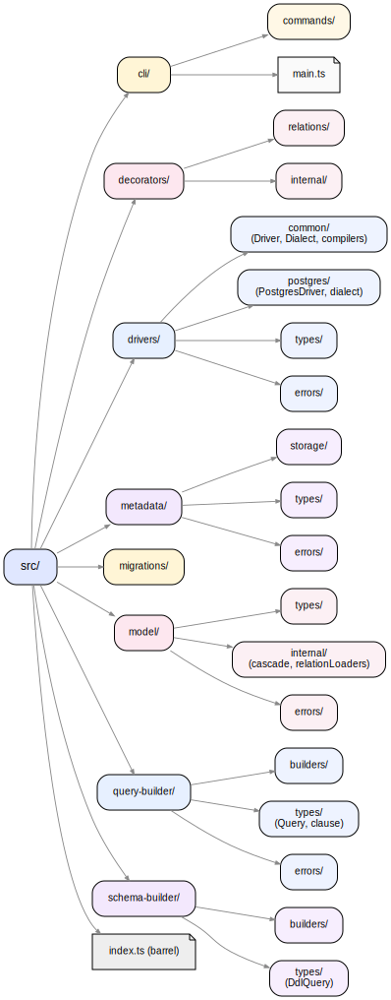

## 3.1 Технологічний стек і структура проєкту

Реалізація YAOI підпорядкована нефункціональним вимогам Н.1 (наскрізна типобезпека), Н.4 (мінімалізм залежностей середовища виконання) та Н.5 (відтворюваність збірки). Цей підрозділ фіксує конкретні версії інструментів, у яких розробляли бібліотеку, та структуру вихідного коду, у якій модульна декомпозиція з підрозділу 2.1 знаходить своє файлове втілення.

### 3.1.1 Мова та середовище виконання

Бібліотека написана мовою TypeScript 5.5 у режимі `"strict": true`; ціль компіляції — `ES2022`, формат модулів — `commonjs`. Опція `"lib"` явно включає `"ESNext.Decorators"`, що активує тип-перевірку Stage 3 TC39 декораторів і робить доступним стандартний контекст метаданих `Symbol.metadata`. Прапорці `"experimentalDecorators": false` і `"emitDecoratorMetadata": false` встановлені свідомо, оскільки YAOI відмовляється від застарілої проміжної форми декораторів і пов'язаного з нею пакета `reflect-metadata` (підрозділ 2.4). Мінімальна підтримувана версія Node.js — 18.0.0; це визначається полем `engines` пакета і узгоджене з потребою у стабільному API `AsyncLocalStorage` (підрозділ 2.7).

Опція `"strictFunctionTypes": false` залишена відключеною як виважений компроміс: ввімкнення цього прапорця у поєднанні з варіантними generic-методами `Repository<T>` і `BaseModel` спричиняло б фальшиві помилки контраваріантності у місцях, де семантично типи коректні. Решта прапорців режиму `strict` (зокрема `strictNullChecks`, `noImplicitAny`, `strictBindCallApply`) залишаються активними, тож основні гарантії типобезпеки збережені.

### 3.1.2 Залежності

Декларація `dependencies` містить лише `pg` (драйвер PostgreSQL версії 8.14) і `@types/pg`. Усі інші пакети — `ts-node` і `tsconfig-paths` — оголошені як необов'язкові peer-залежності і потрібні тільки в режимі розробки; у скомпільованому артефакті, що потрапляє у npm-реєстр, бібліотека імпортує винятково `pg` і стандартні модулі Node.js (`crypto`, `fs/promises`, `path`, `node:async_hooks`). Така будова відповідає вимозі Н.4: користувацький застосунок, що підключає YAOI, не отримує транзитивних залежностей понад той драйвер БД, який і так знадобився б йому самостійно.

Інструменти розробки виокремлено у `devDependencies`: тестування побудоване на Jest 29 із `ts-jest` для прямого виконання TypeScript-тестів та `@testcontainers/postgresql` для одноразових контейнерів СКБД; пакет `expect-type` використовується для виключно типових тверджень, що компілятор перевіряє на стадії `tsc --noEmit`; статичний аналіз — ESLint 8 із набором `@typescript-eslint/strict-type-checked` та власною конфігурацією naming convention; форматування — Prettier 3; генерація API-документації — TypeDoc 0.28.

### 3.1.3 Структура `src/`

Кожному з восьми модулів, описаних у підрозділі 2.1, відповідає однойменна тека першого рівня під `src/`; крім них, у корені модуля присутній лише `index.ts`, що відіграє роль єдиного barrel-файла з публічним експортом. Усередині кожної теки використано однотипний шаблон: підтеки `types/` (декларації типів і AST-вузлів), `builders/` чи `storage/` (доменно специфічні класи), `errors/` (типізовані помилки модуля) та одночасно паралельні з ними `__tests__/` та `__integration__/`, що містять відповідно юніт- і інтеграційні тести. Файлова організація YAOI на момент завершення реалізації показана на рисунку 3.1.

**Рисунок 3.1 — Дерево теки `src/`**

Розмежування між робочим і тестовим кодом проведене на рівні правил включення: тестові файли (`*.spec.ts`, `*.test.ts` і вміст усіх тек `__tests__/` та `__integration__/`) виключені з продакшн-збірки через `tsconfig.build.json`. Така схема дозволяє тестам мати повний доступ до внутрішніх модулів пакета через path-alias `@/*` (мапований у `baseUrl: "./src"`), але при цьому жоден з них не потрапляє у скомпільовану дистрибуцію.

Загальний обсяг робочого коду на момент закриття проєктної частини — 205 файлів TypeScript (близько 7900 рядків), супровідних тестових файлів — 97; з них 47 — юніт-тести Jest, 50 — інтеграційні сценарії, що виконуються в контейнері PostgreSQL.

### 3.1.4 Збірка та CLI

Конвеєр збірки складається з двох послідовних кроків: `tsc -p tsconfig.build.json` компілює TypeScript у `dist/`, а `tsc-alias -p tsconfig.build.json` перетворює невирішені path-alias виду `@/...` у валідні відносні шляхи всередині скомпільованих файлів. Окремий крок другого інструменту необхідний тому, що сам компілятор TypeScript залишає такі імпорти у форматі `@/...`, який працює лише з налаштованим `tsconfig-paths` (доступним у режимі розробки), але не у звичайному Node.js-завантажувачі модулів кінцевого користувача.

CLI-точка входу пакета — `bin/yaoi.js`, тонкий синхронний shim, що завантажує `dist/cli/main.js` і передає у функцію `main` параметри командного рядка з належною обробкою кодів виходу. Версія для розробки — `bin/yaoi.ts` із shebang `#!/usr/bin/env -S npx ts-node -r tsconfig-paths/register` — дозволяє виконувати CLI безпосередньо з вихідного коду під час локальних експериментів. У npm-пакеті присутня лише `.js`-версія; файл `package.json` залишає тільки одне відображення `"bin": { "yaoi": "bin/yaoi.js" }`, що утримує опубліковану поверхню вузькою.

### 3.1.5 Якість коду

Конфігурація ESLint спирається на пресет `plugin:@typescript-eslint/strict-type-checked` — найсуворіший із наявних у `@typescript-eslint`, який вимагає тип-інформованого розбору і виявляє низку дефектів, недосяжних для безтипового лінтингу. Над ним надбудовано власну схему naming convention: іменування типів — `PascalCase`, констант — `camelCase`/`UPPER_CASE`, а булевих змінних — із префіксом із замкненого набору (`is`, `should`, `has`, `can`, `did`, `will`, `does` тощо). Правила `unused-imports/no-unused-imports`, `@typescript-eslint/consistent-type-imports` (із автоматичним fix style `inline-type-imports`) та `no-only-tests/no-only-tests` фіксують ще три типові категорії помилок, що інакше залишаються непомітними у великій кодовій базі.

Допоміжний шар тестування рівня типів реалізований через пакет `expect-type`: твердження виду `expectTypeOf(value).toEqualTypeOf<...>()` перевіряються самим компілятором під час `tsc --noEmit` і гарантують, що публічні типи (`Strict<T, A>`, `Where<T>`, `IncludeConfig<T>`) поводяться очікувано на представницьких прикладах. Цей механізм доповнює рантайм-тести Jest у тих частинах коду, де поведінка реалізується саме системою типів і не залишає відповідної рантайм-логіки для перевірки.

Розглянутий у цьому підрозділі стек є контекстом, на якому далі будуються конкретні модулі YAOI: побудовник запитів, побудовник схеми, шар драйверів і два фасади публічного API. Наступний підрозділ переходить до реалізації Query Builder.
