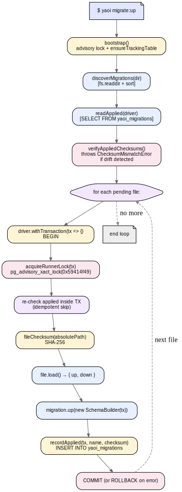

## 4.5 CLI `yaoi`: `migrate:make`/`up`/`down`/`status`

Описане в попередніх підрозділах ядро `MigrationRunner` є чистою TypeScript-бібліотекою — без власного зв'язку зі стандартним вводом-виводом, без знання про конфігурацію проєкту, без аргументів командного рядка. CLI-шар модуля `cli/` поверх нього розв'язує саме ці три інфраструктурні питання, залишаючись тонкою обгорткою без власної бізнес-логіки.

### 4.5.1 Точка входу та архітектура диспетчера

Виконуваний файл `bin/yaoi.js` — це тонкий синхронний shim із трьома рядками: `require("../dist/cli/main.js").main(process.argv.slice(2))` із обробкою кодів виходу та виключень. Уся фактична логіка винесена у `src/cli/main.ts`, що реалізує лінійний алгоритм: розбір аргументів через `parseArgs(argv)`, рання обробка `--help`, завантаження конфігурації через `loadConfig({ explicitPath })`, диспатчинг до однієї з чотирьох команд через `switch (args.command)`.

Розбір аргументів реалізовано як власна мінімалістична функція `parseArgs`, що повертає об'єкт із трьох полів: `command` (перше нефлагове значення), `positional` (решта нефлагових значень) і `flags` (записані як `Record<string, string | true>`). Власна реалізація обрана замість сторонньої залежності (на кшталт `yargs`/`commander`) свідомо: вона займає 50 рядків коду, не має зовнішніх залежностей у runtime (вимога Н.4) і повністю покриває набір CLI-флагів YAOI — `--config`, `--to`, `--name`, `--help`/`-h`.

### 4.5.2 Конфігураційний файл і `defineConfig`

Конфігурація проєкту описується файлом `yaoi.config.ts` (з підтримуваними альтернативами `.js`, `.cjs`, `.mjs`) у корені проєкту користувача. Реєстрація `ts-node` для `.ts`-конфігів виконується ліниво — лише при потребі (`registerTsNode()` із `isTsNodeRegistered` як одноразовий guard), що уникає накладних витрат для `.js`-конфігів. Для зручності YAOI експортує helper-функцію `defineConfig(config)`, що повертає аргумент без змін — її єдина мета — забезпечити коректне типове виведення в `yaoi.config.ts` без явних анотацій (`as YaoiConfig` тощо).

Лістинг 4.2 показує типовий `yaoi.config.ts` і приклади викликів CLI-команд.

**Лістинг 4.2 — Конфігурація проєкту і сесія CLI**

```ts
// yaoi.config.ts
import { defineConfig, DBType } from "yaoi";

export default defineConfig({
  driver: {
    type: DBType.POSTGRES,
    host: process.env.DB_HOST ?? "localhost",
    port: Number(process.env.DB_PORT ?? 5432),
    user: process.env.DB_USER ?? "app",
    password: process.env.DB_PASSWORD ?? "",
    database: process.env.DB_NAME ?? "app_dev",
  },
  migrationsDir: "./migrations",
});
```

```text
$ yaoi migrate:make add_posts_table
Created migration: 20250115134210_add_posts_table.ts
/abs/path/to/migrations/20250115134210_add_posts_table.ts

$ yaoi migrate:status
NAME                                     APPLIED  AT                       MISMATCH
20250112090000_init                      ✓        2025-01-12 09:01:14 UTC  no
20250115134210_add_posts_table           pending  -                        -

$ yaoi migrate:up
Applied: 20250115134210_add_posts_table
Applied 1 migration(s).

$ yaoi migrate:down
Rolled back: 20250115134210_add_posts_table
```

Завантажений конфіг проходить функцію `validateConfigShape`, що піднімає типізовану `ConfigShapeError` із посиланням на конкретний шлях у разі відсутності `migrationsDir`, `driver` чи `driver.type`. Така валідація — мінімум: повна type-перевірка `DriverConfig` залишається відповідальністю TypeScript-компілятора у `yaoi.config.ts` користувача, а CLI лише блокує очевидно невалідні форми, що могли б призвести до неочікуваних поведінок далі.

### 4.5.3 `migrate:make`: генерація файлу за шаблоном

Команда `migrate:make <name>` створює новий файл міграції у директорії з конфігурації. Алгоритм мінімальний: побудувати ім'я як `{timestampPrefix}_{slugify(name)}.ts`, де `timestampPrefix` — UTC-час у форматі `YYYYMMDDhhmmss`, а `slugify(name)` — нормалізація вільної назви у латиницю/цифри/підкреслення з обмеженням до 60 символів; створити саму директорію через `fs.mkdir(..., { recursive: true })` і записати файл із прапорцем `wx` (failed if exists), що захищає від випадкового перезапису. Сам шаблон файлу зберігається у константі `MIGRATION_TEMPLATE` і містить готовий `import { Migration, SchemaBuilder } from "yaoi"` та порожні `up`/`down`-функції із позначками `// TODO: implement`.

Префікс із timestamp — основа сортування discoverMigrations і, відповідно, порядку застосування. Завдяки тому, що `discoverMigrations` сортує лексикографічно, а timestamps мають однакову довжину і монотонність, забезпечується природний хронологічний порядок без додаткової логіки.

### 4.5.4 Команди `migrate:up`/`migrate:down`/`migrate:status`

Усі три команди мають однакову структуру: створити `MigrationRunner` через спільну фабрику `makeRunner(loaded)` (яка ініціалізує драйвер і обгортає його у try/finally із гарантованим shutdown), викликати відповідний метод runner'а, вивести результат у термінал. Команда `migrate:up` приймає опційний `--to <name>` — застосувати міграції включно з указаною (зупинитися після неї). `migrate:down` приймає опційний `--name <name>` як safety-check: якщо передане ім'я не збігається з найсвіжішою застосованою, піднімається `OutOfOrderRollbackError`; у такий спосіб розробник може документувати намір «я хочу відкотити саме цю міграцію» і отримати миттєвий сигнал, якщо стан БД виявився інакшим за очікуваний.

Команда `migrate:status` форматує результат у вирівняну таблицю через утиліту `renderStatusTable(rows)` — без зовнішніх залежностей на CLI-форматування. Сам виклик не змінює стан БД і не вимагає advisory lock'а (лише `bootstrap()` для гарантованого існування таблиці-журналу), тож може використовуватися безпечно як інструмент діагностики у будь-якому стані середовища.

### 4.5.5 Коди виходу та обробка помилок

Файл `cli/exitCodes.ts` оголошує перелік `ExitCode` із чотирма значеннями: `OK = 0`, `RUNTIME = 1`, `USAGE = 2`, `CONFIG = 3`. Розшарування на три класи ненульових кодів дозволяє CI-системам розрізняти три якісно різні причини провалу. Класифікація прозора: `CliUsageError` (неправильний синтаксис команди, відсутній обов'язковий аргумент) → `USAGE`; `ConfigNotFoundError`/`ConfigShapeError` (проблема з конфігураційним файлом) → `CONFIG`; усі інші виключення (помилки самої міграції, drift, advisory lock timeout, мережа) → `RUNTIME`. Текст повідомлення піднятого виключення (з `err.message`) виводиться у stderr через утиліту `error(...)`, без stack trace — щоб не засмічувати логи продакшн-середовища; для діагностики розробник може встановити перемінну середовища `DEBUG=*` і запустити CLI у dev-режимі через `npx ts-node bin/yaoi.ts ...`, що покаже повний trace.

### 4.5.6 Підбиття підсумків розділу

Підсистема міграцій YAOI становить єдиний логічно й транзакційно консистентний шар поверх загального ядра ORM. Чотири основні гарантії — інтерфейс «двофункціонального файлу», SHA-256 контрольні суми проти drift, транзакційний DDL для атомарності та advisory lock для безпеки одночасних запусків — у сумі гарантують, що схема БД проходить детермінований шлях від першої порожньої БД до поточного стану, з повним аудитом у самій базі та можливістю відкатів. Над цим ядром CLI-шар надає мінімальний звичний інтерфейс, що інтегрується з типовими `npm`-скриптами, CI/CD-конвеєрами і Docker-entrypoint'ами. Загальна схема життєвого циклу `migrate:up` зображена на рисунку 4.1.



**Рисунок 4.1 — Життєвий цикл `migrate:up`**

Опис реалізації самої бібліотеки і її допоміжних шарів завершено в розділах 3 та 4. Наступний розділ переходить до зовнішнього погляду: порівняльного аналізу YAOI із чинними TypeScript-ORM TypeORM, Objection.js та Drizzle за ключовими критеріями типобезпеки, виразності та зрозумілості API.
