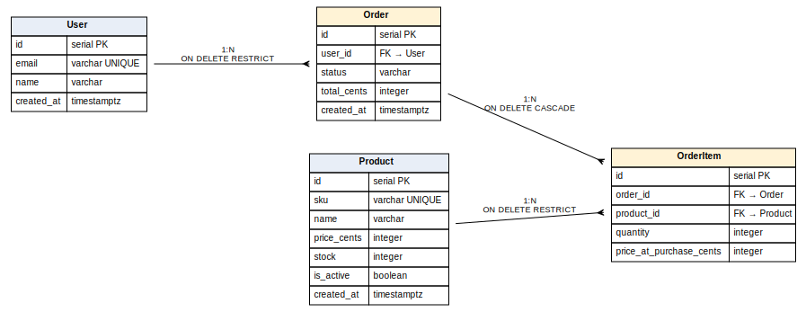

## 6.2 Доменна модель

### 6.2.1 Сутності та зв'язки

Доменна модель mini-shop складається з чотирьох сутностей з ієрархічною структурою: `User` і `Product` — корневі довідники, `Order` агрегує покупки одного користувача, а `OrderItem` фіксує позицію в межах конкретного замовлення (рисунок 6.1). Між сутностями встановлено три зв'язки 1:N, без жодного зв'язку N:M, що відображає природну характеристику предметної області: позиція замовлення завжди належить одному замовленню і посилається на один товар.

**Рисунок 6.1 — ER-діаграма доменної моделі mini-shop**



Сторона «один» у кожному зв'язку відображається у YAOI декоратором `@OneToMany`, сторона «багато» — `@ManyToOne` із параметром `joinColumn` для явного зазначення колонки, що несе FK. Параметр `inverseSide` обов'язково вказує проперті на протилежній стороні, що дає YAOI можливість резолвити зв'язок в обох напрямках при eager-loading (підрозділ 3.7).

### 6.2.2 Каскадні правила видалення

Правила `ON DELETE` обрано виходячи зі смислового контракту:

- **`Order → OrderItem`: CASCADE.** Видалення замовлення тягне за собою видалення його позицій, бо OrderItem без батьківського Order — це «осиротілий» рядок без бізнес-сенсу. Стандартний паттерн для агрегату.
- **`User → Order`: RESTRICT.** Видалення користувача із розміщеними замовленнями заборонене на рівні бази — це б знищило аудиторську інформацію про факт купівлі та призвело б до неузгодженості фінансових звітів. На рівні застосунку це означає, що видалити користувача можна лише після явної архівації або переадресації його замовлень.
- **`Product → OrderItem`: RESTRICT.** Видалення товару, що фігурує в позиціях замовлень, заборонене з тих самих міркувань: ціна, кількість і факт покупки збережені у `OrderItem`, але посилання на товар важливе для звітності. Замість видалення товар маркують `is_active = false` (декларується у міграції 3 разом із частковим індексом).

### 6.2.3 Снапшот ціни в OrderItem

Ціна товару зберігається у `OrderItem.priceAtPurchaseCents` як знімок на момент оформлення, а не береться через JOIN із `Product.priceCents`. Це класичний паттерн фінансового домену: ціна товару може змінюватися з часом, але історичні замовлення мусять зберігати оригінальну суму. Альтернатива з обчисленням ціни через JOIN на поточний `Product.priceCents` була б некоректною — відображала б ретроактивно ціну на момент перегляду, а не на момент покупки. Аналогічно `Order.totalCents` зберігає суму як знімок, обчислений у `placeOrder`-транзакції.

### 6.2.4 Декларація сутностей у YAOI

Усі чотири сутності декларуються як класи-нащадки `BaseModel` із декораторами `@Entity`, `@PrimaryKey`, `@Column`, `@ManyToOne`, `@OneToMany` — паттерн, описаний у підрозділі 3.3. Лістинг 6.1 показує парну декларацію `Order` і `OrderItem`, що демонструє двосторонній зв'язок 1:N разом із другим зв'язком `OrderItem.product → Product`.

**Лістинг 6.1 — Декларація сутностей `Order` і `OrderItem` (фрагмент `src/entities/`)**

```ts
@Entity({ name: "orders" })
export class Order extends BaseModel {
  @PrimaryKey({ type: "integer", generated: "identity" })
  public id!: number;

  @Column({ type: "integer", name: "user_id" })
  public userId!: number;

  @Column({ type: "string" })
  public status!: OrderStatus;

  @Column({ type: "integer", name: "total_cents" })
  public totalCents!: number;

  @Column({ type: "timestamptz", name: "created_at" })
  public createdAt!: Date;

  @ManyToOne(() => User, { joinColumn: { name: "user_id" }, inverseSide: "orders" })
  public user!: Relation<User>;

  @OneToMany(() => OrderItem, { inverseSide: "order" })
  public items!: Relation<OrderItem[]>;
}

@Entity({ name: "order_items" })
export class OrderItem extends BaseModel {
  @PrimaryKey({ type: "integer", generated: "identity" })
  public id!: number;

  @Column({ type: "integer", name: "order_id" })
  public orderId!: number;

  @Column({ type: "integer", name: "product_id" })
  public productId!: number;

  @Column({ type: "integer" })
  public quantity!: number;

  @Column({ type: "integer", name: "price_at_purchase_cents" })
  public priceAtPurchaseCents!: number;

  @ManyToOne(() => Order, { joinColumn: { name: "order_id" }, inverseSide: "items" })
  public order!: Relation<Order>;

  @ManyToOne(() => Product, { joinColumn: { name: "product_id" }, inverseSide: "orderItems" })
  public product!: Relation<Product>;
}
```

Тип `OrderStatus` декларовано окремо як TypeScript-юніон (`"pending" | "paid" | "shipped" | "cancelled"`): YAOI не має нативної підтримки enum-стовпців і зберігає статус як `varchar`, тоді як TS-юніон забезпечує перевірку допустимих значень у прикладному коді на етапі компіляції. Поля `id` мають стратегію `generated: "identity"` — це маркер для DML-pipeline'у YAOI пропустити PK у `INSERT VALUES`, очікуючи, що значення буде згенеровано на стороні Postgres через `GENERATED BY DEFAULT AS IDENTITY` (підрозділ 3.5).

### 6.2.5 Міграційний план

Декларація сутностей не створює таблиць автоматично — це політика YAOI, що віддає схему під явний контроль handwritten-міграцій (підрозділ 4.1). Для mini-shop написано три файли під `examples/mini-shop/migrations/`:

1. `20260521120000_create_users_and_products.ts` — створює таблиці `users` і `products` з відповідними UNIQUE-обмеженнями (`email`, `sku`).
2. `20260521120100_create_orders_and_items.ts` — таблиці `orders` і `order_items` із трьома FK-зв'язками і правилами `ON DELETE` із 6.2.2.
3. `20260521120200_add_indices.ts` — індекс `(user_id, status)` на `orders` для прискорення `/users/:id/orders?status=…`, індекс `(order_id)` на `order_items` і частковий індекс на `products(is_active) WHERE is_active = TRUE` для зменшення розміру індексу при типовому запиті лише активних товарів.

Кожен файл експортує об'єкт `Migration` із парою `up`/`down`-функцій, що приймають `SchemaBuilder`. Реалізація `down` симетрична `up` — таблиці видаляються у зворотному порядку зі `{ ifExists: true }`, що робить кожну міграцію оборотною без зайвих припущень про стан БД.
